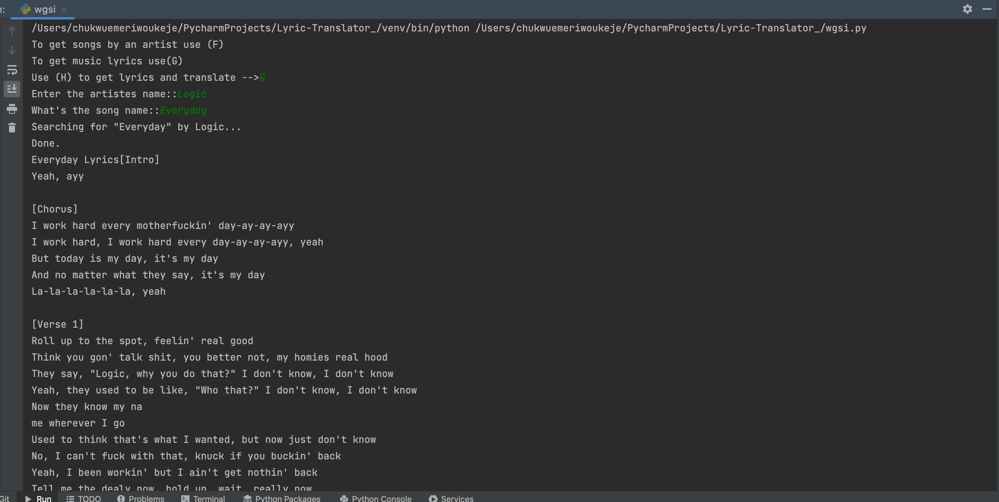
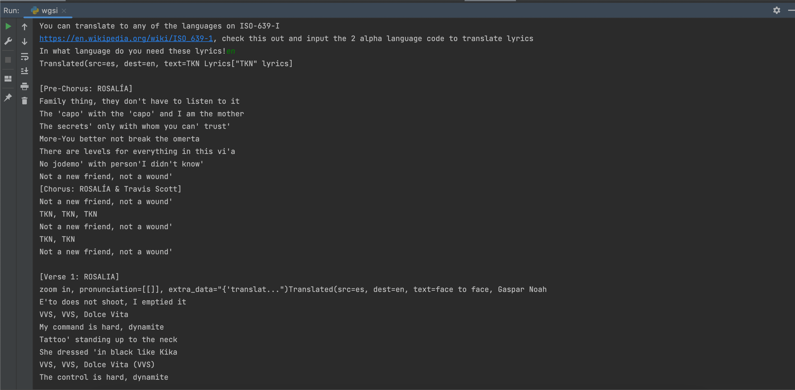

# ISO 631 Lyric Translator

This is a simple lyric translator using the Genius API and the Google translate SDK.

## 📸 Screenshots

### Retrieving Lyrics by Song (_no translation_)

### Retrieving Lyrics by Song (translated from spanish to english)

Contributions are welcome
